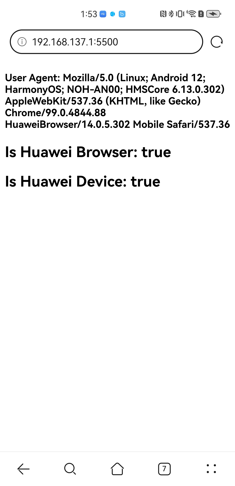

# Huawei Browser Detection (JavaScript)

## **Description:**

This project provides a simple JavaScript snippet that attempts to detect if the user is browsing using a Huawei browser. It checks for the presence of the string "Huawei" or a Huawei device model prefix within the user agent string.

## **Disclaimer:**

This code is for demonstration purposes only and has been **tested solely on Huawei phones with the pre-installed Huawei browser**. It might not work reliably on other browsers, and user agent strings can be spoofed. This script should not be used for critical applications.

## **Screenshot:**




## **How to Use:**

1. Add the following JavaScript script to your project: `HuaweiDetector.js`.
2. Include the script in your HTML file using the `<script>` tag

```html
<script src="HuaweiDetector.js"></script>
```

3. Call the functions `isHuaweiBrowser()` or `isHuaweiAndroidPhone()`


## **Implementation:**

#### Detect Huawei Browser

```javascript
// Check if the user agent string contains "Huawei" (case-insensitive)
function isHuaweiBrowser() {
  const userAgent = navigator.userAgent;
  return /Huawei/i.test(userAgent);
}
```

#### Detect Huawei device

```javascript
// Check if the user agent string contains a Huawei device Model prefix
function isHuaweiAndroidPhone() {
  //todo: add safety tests
  const userAgent = navigator.userAgent;
  const isAndroid = /Android/i.test(userAgent);
  if (isAndroid) {
    const modelsRegex =
      /ALP-|AMN-|ARS-|ANE-|BAC-|BLA-|CAG-|CAM-|CAN-|CAZ-|CDL-|CLT-|CRO-|EVE-|RUNE-|BAL-|AND-|BNE-|DCO-|CET-|CHA-|GOT-|GLA-|NCO-|BAH4-|PAL-|ODN-|FRG-|MLY-|Ags3K-|AGS5-|MGA-|ABR-|JLN-|JuliaQN-|RMX2190-|FIO-|JSC-|WKG-|Wukong-|MLD-|MIL-|RTE-|Hebe-|NAM-|ANG-|JAD-|CHL-|NEN-|NOH-|OCE-|TET-|WGR-|MRR-|DBY-|BRQ-|AGRK-|ANA-|PPA-|NOP-|VID-|LIO-|BAH3-|FRL-|SCMR-|AGS3-|NIK-|DVC-|AQM-|CDY-|Kobe2-|KOB2-|MED-|DRA-|JER-|JEF-|HCT-|ELS-|ART-|JNY-|TAH-|WLZ-|MRX-|TAS-|LTN-|DAN-|LEM-|FGD-|XYAO-|BON-|CLB-|ALN-|ARA-|PNX-|ALT-|BRA-|DBY2-|STG-|MDS-|ARC-|GOA-|FOA-|MNA-|LNA-|DBR-/i;

    return modelsRegex.test(navigator.userAgent);
  }
  return false;
}
```

_device model list is fetched from GSMArena: <https://www.gsmarena.com/huawei-phones-58.php>_  
_detailed list of device models can be found in `hauwei_devices.json`_

> Huawei browser example user agent: Mozilla/5.0 (Linux; Android 10; LIO-AL00; HMSCore 5.0.4.301) AppleWebKit/537.36 (KHTML, like Gecko) Chrome/83.0.4103.106 HuaweiBrowser/11.0.4.300 Mobile Safari/537.36";